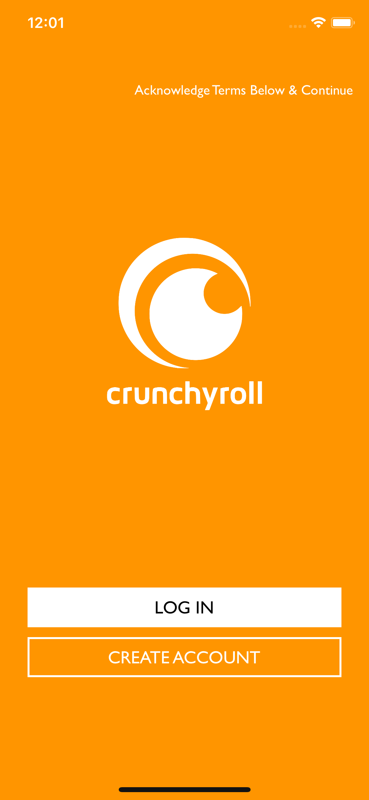
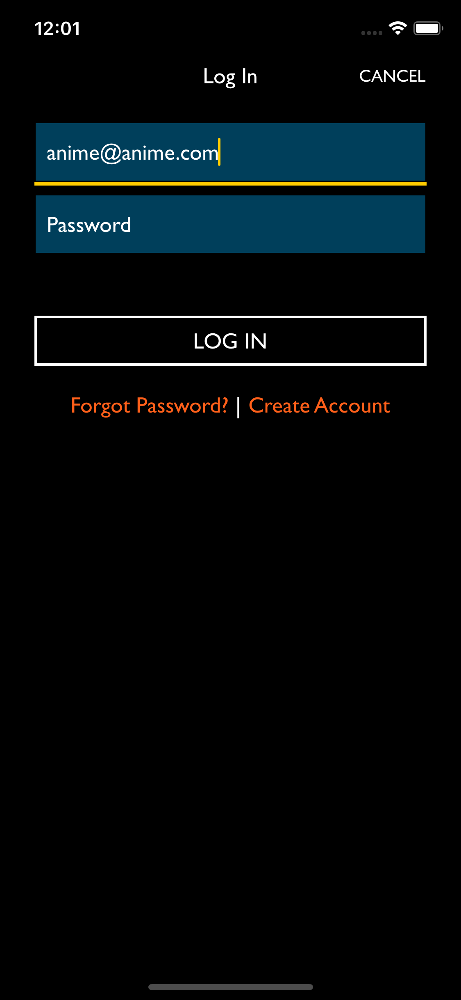
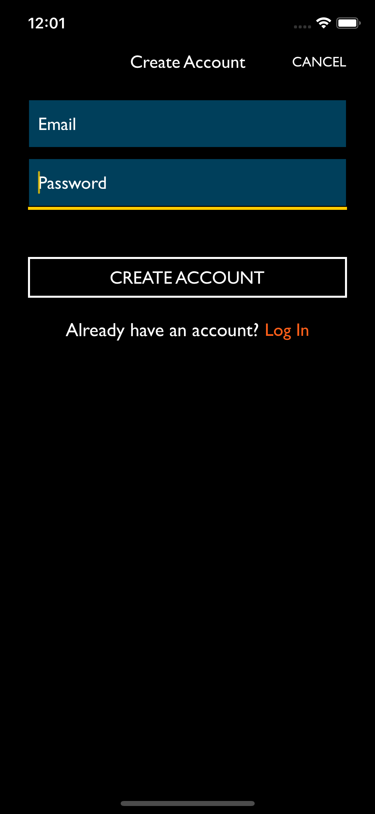
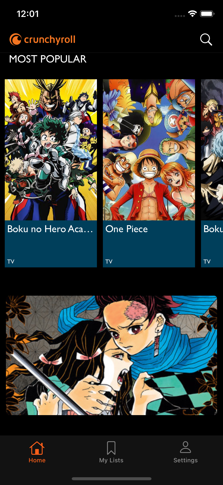
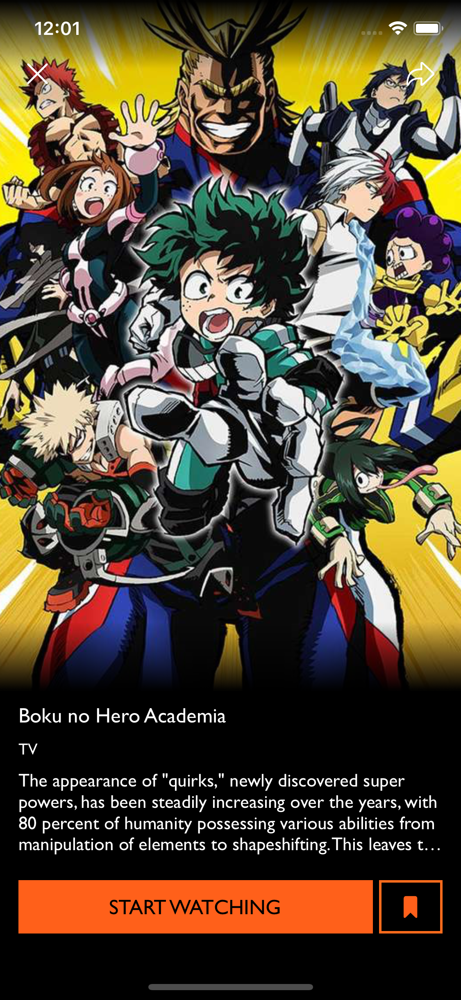
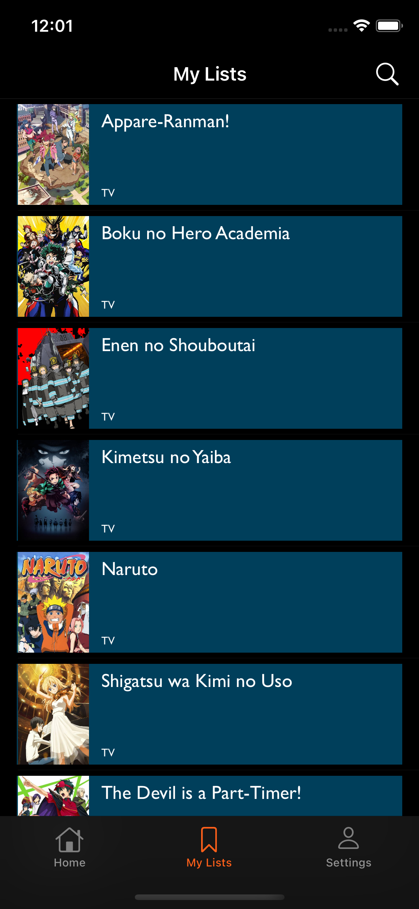
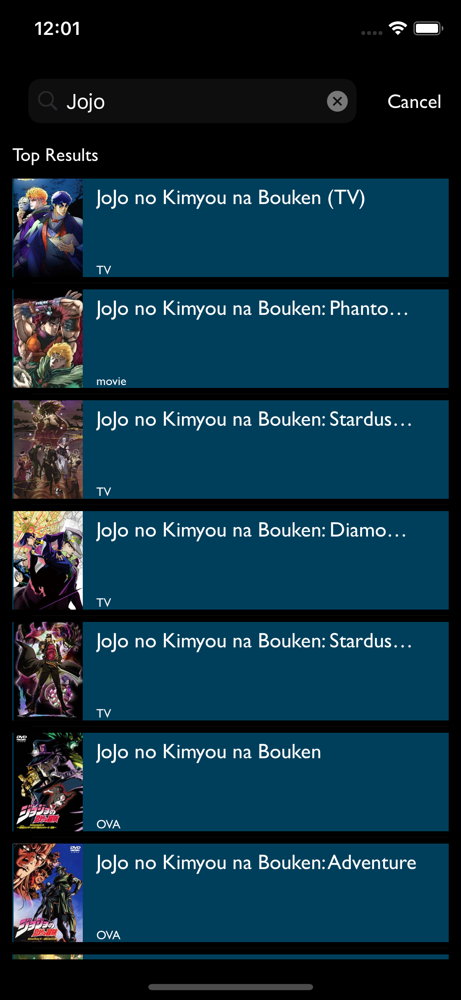

# Crunchyroll Clone

### A fullstack iOS app clone based off the [Crunchyroll](https://apps.apple.com/us/app/crunchyroll/id329913454?itsct=apps_box&itscg=30200) app
#### Built using UIKit, Firebase, and [Kitsu API Docs](https://kitsu.docs.apiary.io/#reference/anime/episodes/fetch-collection)

* Xcode 12 and Swift 5
* Cocoapods Version 1.10
* FirebaseFirestore (>= 1.6.1, ~> 1.6)

Purpose of this app was to have more practice with Firebase, Networking with an API, and re-creating professional level user interfaces.

Sign in authentication with Firestore and add animes to a watchlist that is stored onto Firestore.

<h2 align= "center"> Welcome Screen</h2>

<h2 align= "center"> Login Screen / Create Screen </h2> 

<h2 align= "center">Home Screen / Details Screen </h2>

<h2 align="center"> My Lists Screen / Search Screen </h2>

Disclaimer: 
The crunchyroll image and logo is owned by [crunchyroll](https://www.crunchyroll.com). 
I used them purely for educational purposes and am not attempting to take credit for the image and logo. 
Link to API: [Kitsu API Docs](https://kitsu.docs.apiary.io/#reference/anime/episodes/fetch-collection)
